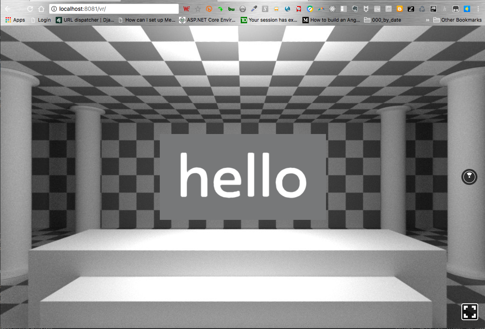

# React VR Demo - 2018

Illustrating the Basic Usage of ReactVR.

`npm install -g react-vr-cli`

then

`react-vr init somedirectory`

Now enter the new project directory by running `cd somedirectory`
Run `npm start` to initialize the development server
From there, browse to http://localhost:8081/vr/
Open `index.vr.js` to begin editing your app.

You will see something like this, which you can play with...

 

